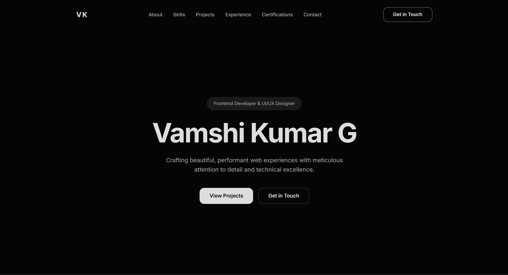

# 👨‍💻 V K Personal Portfolio


A modern, high-performance personal portfolio website built with **HTML5, CSS3, and Vanilla JavaScript**. 

Designed with a focus on **UI/UX**, this portfolio features buttery-smooth animations, a responsive glassmorphism design, and a fully functional contact form without a backend server.

🔗 **[Live Demo](https://your-username.github.io/repo-name)** ---

## ✨ Key Features

* **🎨 Modern Dark UI:** sleek, contrast-heavy design with a premium feel.
* **📱 Fully Responsive:** Optimized for Mobile, Tablet, and Desktop.
* **💨 Smooth Animations:** Custom cubic-bezier transitions using Intersection Observer API.
* **✨ Glassmorphism:** Frosted glass navbar effect on mobile devices.
* **⚡ High Performance:** Pure Vanilla JS (No heavy frameworks like jQuery or Bootstrap).
* **📧 Working Contact Form:** Integrated with **Web3Forms** for serverless email handling.
* **📁 Dynamic Project Rendering:** Project cards are injected via JavaScript, making updates easy.

---

## 🛠️ Tech Stack

* **Frontend:** HTML5, CSS3 (CSS Variables, Flexbox, Grid), JavaScript (ES6+)
* **Icons:** SVG Icons (Feather Icons style), Icons8 (Color Icons)
* **Fonts:** Inter (Google Fonts)
* **Form Handling:** Web3Forms API

---

## 📂 Project Structure

```text
/Portfolio
│
├── index.html          # Main HTML structure
├── style.css           # Global styles, animations, and responsive queries
├── script.js           # Project data, logic, and animation observers
│
├── assets/             # Folder for images
│   ├── FuelUp.png
│   ├── kraze.png
│   ├── nexus.png
│   └── chatse.png
│
└── README.md           # Project documentation